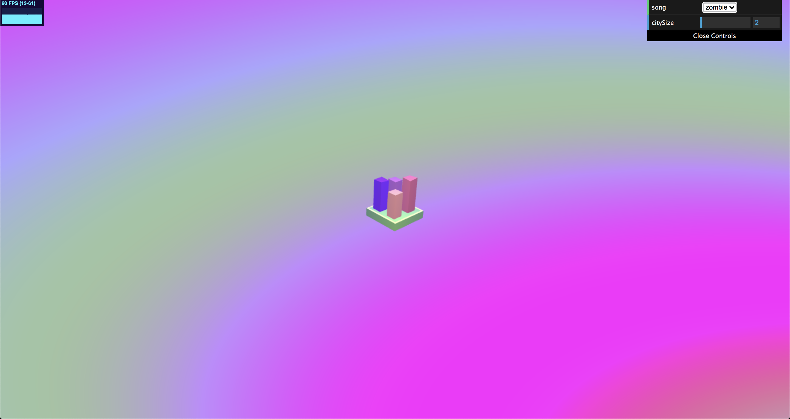
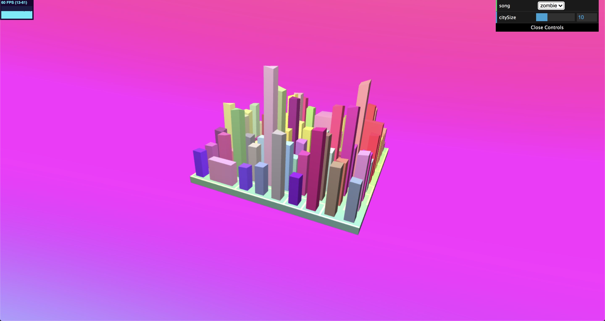
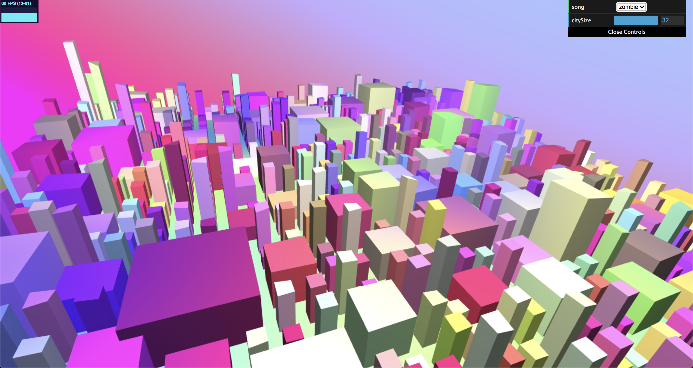

# README

## Demo
Live demo [here](https://linda-ting.github.io/final-project/)!

## Design Doc

### Introduction
I have tinkled a bit with music visualizers in the past, but only by using signals from the music directly to influence the visuals. Using some of the procedural techniques I have learned about and applied during the course to make a more robust and stylized visualizer would be very fun! :~)

### Goal
I hope to create a mini synthwave, cyberpunk, retrofuture city visualizer, where cars drive by and buildings grow and collapse with the music. I would also like the user to be able to interact with and influence the visualizer in some way, whether it be tweaking parameters for noise generation or adjusting the color scheme.

### Inspiration/reference:
Here are a whole bunch of inspo images!

### Specification:
- A main platform in the center of the screen representing a chunk of blocks in the city
- Tile-based road generation with cars driving on them
- Buildings generated using shape grammars that grow/shrink in size over time
- Ability for user to rotate block in space to see all sides (maybe by default slowly rotate over time?)

### Techniques:
- [Shape grammars](https://www.gamedev.net/tutorials/programming/engines-and-middleware/procedural-modeling-of-buildings-with-shape-grammars-r4596/)/L systems for building and road footprints
- FBM/Perlin noise for adjusting building heights

### Design:

### Timeline:
- Week 1: 
  - Set up city block platform
  - Set up basic rendering pipeline (using Lambertian shading, single light source)
  - Complete road generation
  - Set up building footprint generation
- Week 2: 
  - Complete building animation 
  - Add camera animation
  - Bug fixes
- Week 3: 
  - Beautifying!
  - Enhance shaders
  - Customize lighting setup
  - Stylize colors

## Output:
Below are screenshots of generated visualizer cities of different sizes.

## Post Mortem
One major feature that I was not able to implement was an interesting shape grammar to make the city buildings more varied and interesting. This would definitely be a fun point of future work! In the meantime, I think having a large enough city with buildings of different footprints achieves a similar enough effect. I accomplished all of the basic goals of my generator, but if given the opportunity I would want to work more on beautifying and stylizing a bit more. 