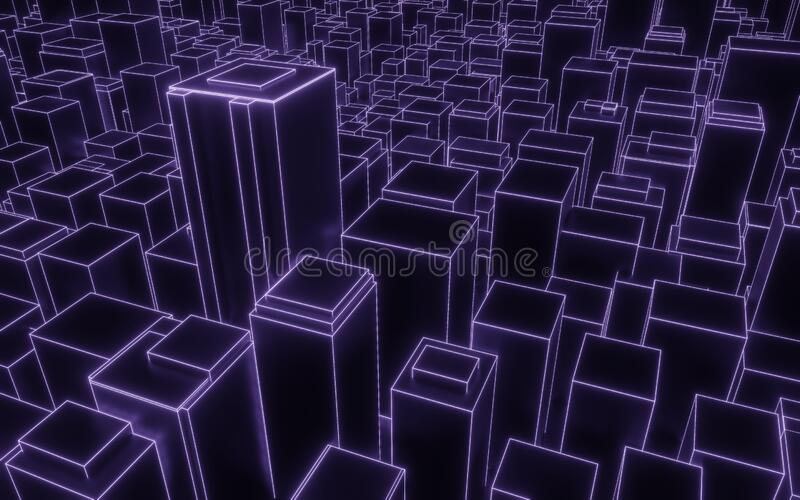
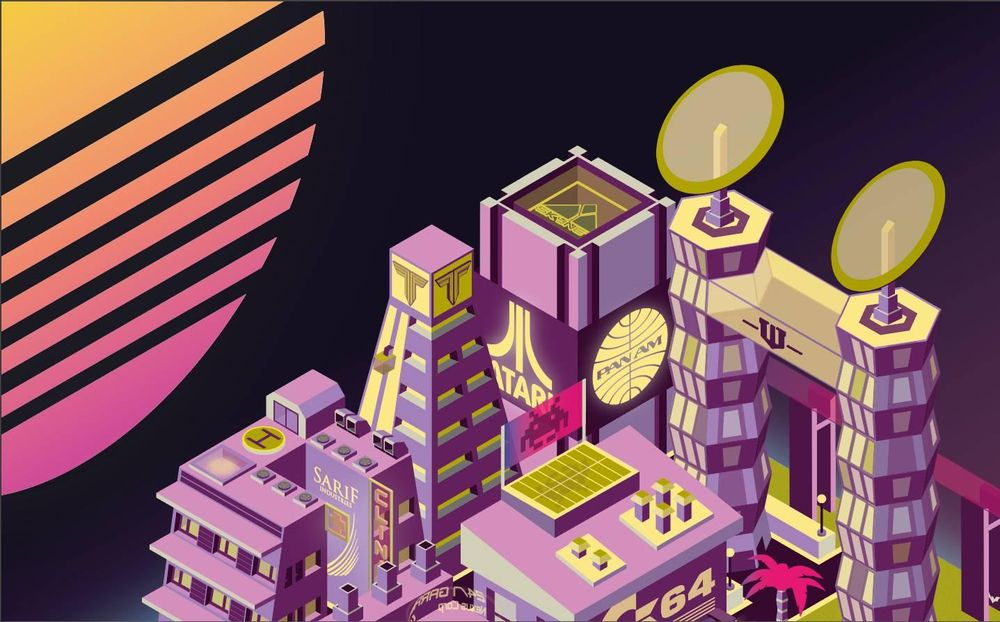
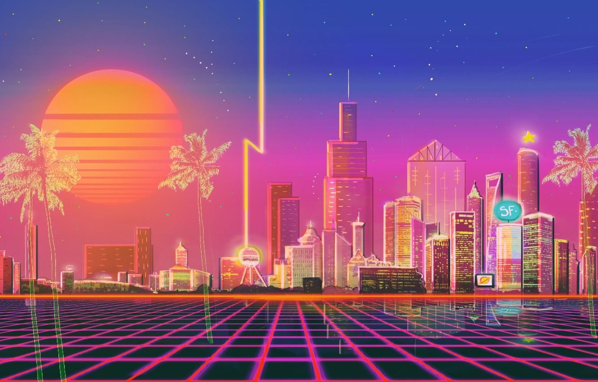
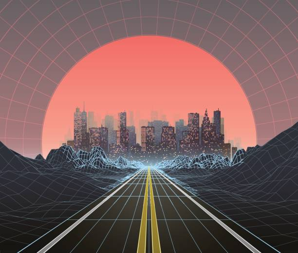
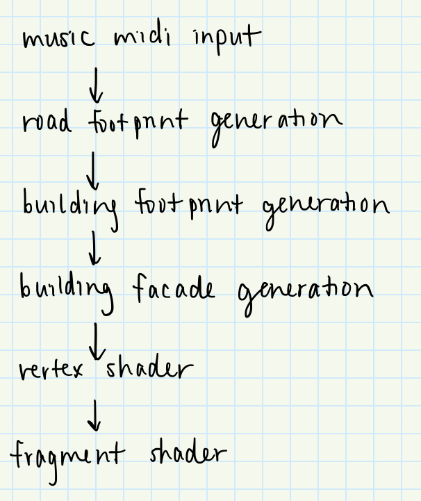

# Final Project!

This is it! The culmination of your procedural graphics experience this semester. For your final project, we'd like to give you the time and space to explore a topic of your choosing. You may choose any topic you please, so long as you vet the topic and scope with an instructor or TA. We've provided some suggestions below. The scope of your project should be roughly 1.5 homework assignments). To help structure your time, we're breaking down the project into 4 milestones:

## Milestone 1: Project planning (due 11/15)
Before submitting your first milestone, _you must get your project idea and scope approved by Rachel, Adam or a TA._

### Design Doc

#### Introduction
I have tinkled a bit with music visualizers in the past, but only by using signals from the music directly to influence the visuals. Using some of the procedural techniques I have learned about and applied during the course to make a more robust and stylized visualizer would be very fun! :~)

#### Goal
I hope to create a mini synthwave, cyberpunk, retrofuture city visualizer, where cars drive by and buildings grow and collapse with the music. I would also like the user to be able to interact with and influence the visualizer in some way, whether it be tweaking parameters for noise generation or adjusting the color scheme.

#### Inspiration/reference:
Here are a whole bunch of inspo images!

#### Specification:
- A main platform in the center of the screen representing a chunk of blocks in the city
- Tile-based road generation with cars driving on them
- Buildings generated using shape grammars that grow/shrink in size ovr time
- Ability for user to rotate block in space to see all sides (maybe by default slowly rotate over time?)

#### Techniques:
- [Shape grammars](https://www.gamedev.net/tutorials/programming/engines-and-middleware/procedural-modeling-of-buildings-with-shape-grammars-r4596/)/L systems for building and road footprints
- FBM/Perlin noise for adjusting building heights
- [Bloom](https://learnopengl.com/Advanced-Lighting/Bloom) for neon lighting effects

#### Design:

#### Timeline:
- Week 1: 
  - Set up city block platform
  - Set up basic rendering pipeline (using Lambertian shading, single light source)
  - Complete road generation
  - Set up building footprint generation
- Week 2: 
  - Complete building animation 
  - Add camera animation
  - Bug fixes
- Week 3: 
  - Beautifying!
  - Enhance shaders
  - Customize lighting setup
  - Stylize colors

## Milestone 1: 
Submission: Add a new section to your README titled: Milestone #1, which should include
- written description of progress on your project goals. If you haven't hit all your goals, what's giving you trouble?
- Examples of your generators output so far